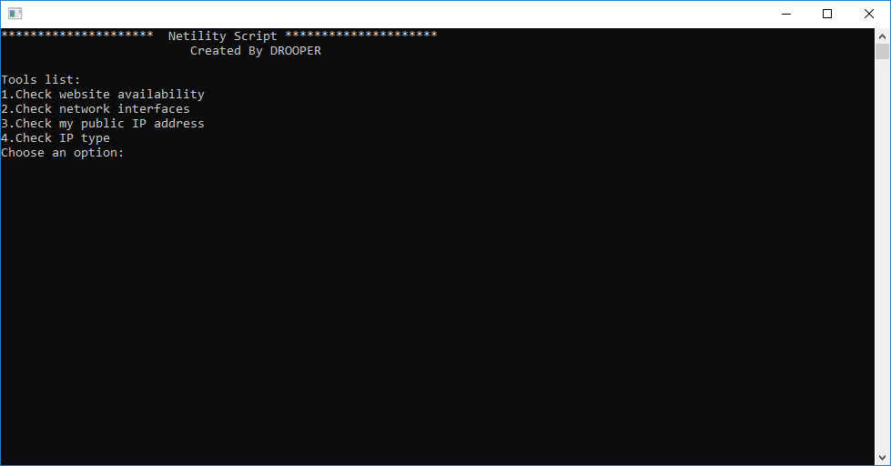

# Netility Network Tool
A usefull script written in C++ for Linux and Windows that gathers the following information:
 
 -Public IP 
  
 -Website availability
  
 -IP address type ( Static/Dynamic )
  
 -Network interfaces
 

